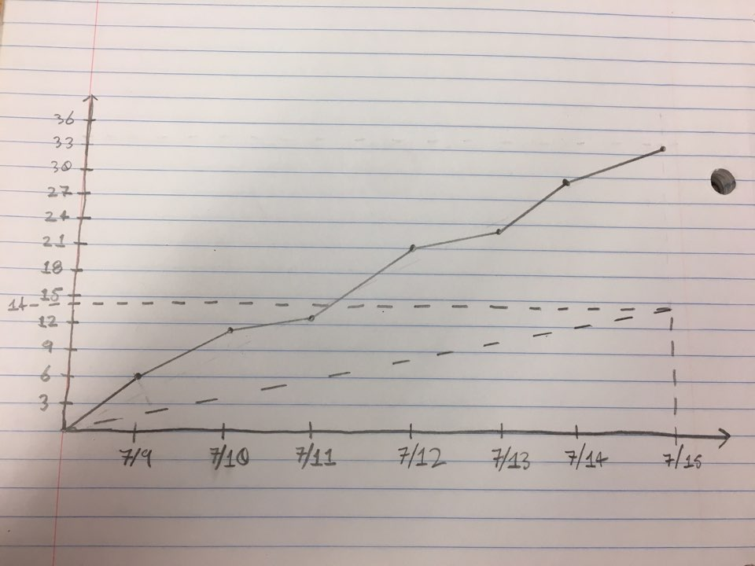

# AI Vocabulary

​																										July. 16. 2019

## Actions to stop doing 

- Stop working on learning spikes.

## Actions to start doing

- Start pair programming 

## Actions to keep doing

- regular in-person meetings with "daily" scrum
- answer the three daily scrum questions
- more knowledgeable teammates give help to the less knowledgeable teammates

## Work completed 

- Learning Django
- Implementing frequency checker
- making text input UI
- Construct DB for saving known and unknown words
- Upload app to AWS

## Work Completion Rate
- User stories completed: 1 / 1
- Completed Ideal Working Hours: 34
- Days for Prior Sprint: 7
- User Stories / Day: 1/7 
- Ideal Working Hours / Day: 34/7 ~= 5

