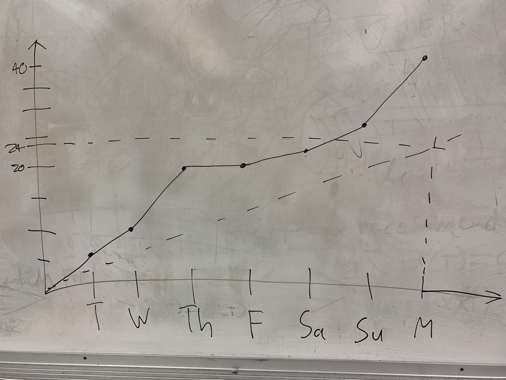

# AI Vocabulary

July 23rd, 2019

## Actions to stop doing 

- Nothing

## Actions to start doing

- Do pair programming

## Actions to keep doing

- Regular in-person meetings with "daily" scrum
- Answer the three daily scrum questions
- More knowledgeable teammates give help to the less knowledgeable teammates

## Work completed 

- Understand SVD algorithm and implement SVD using JS
- Gather learning data & Estimate accuracy of SVD
- UI for recommended words list using HTML and CSS & Attach UI to Django app
- Translate recommended words
- Simple quiz generator of recommended words

## Work Completion Rate
- User stories completed: (jae, say how many user stories were completed)/2
- Completed Ideal Working Hours: 38
- Days for Prior Sprint: 7
- User Stories / Day: 2/7
- Ideal Working Hours / Day: 38/7 ~= 5.43

