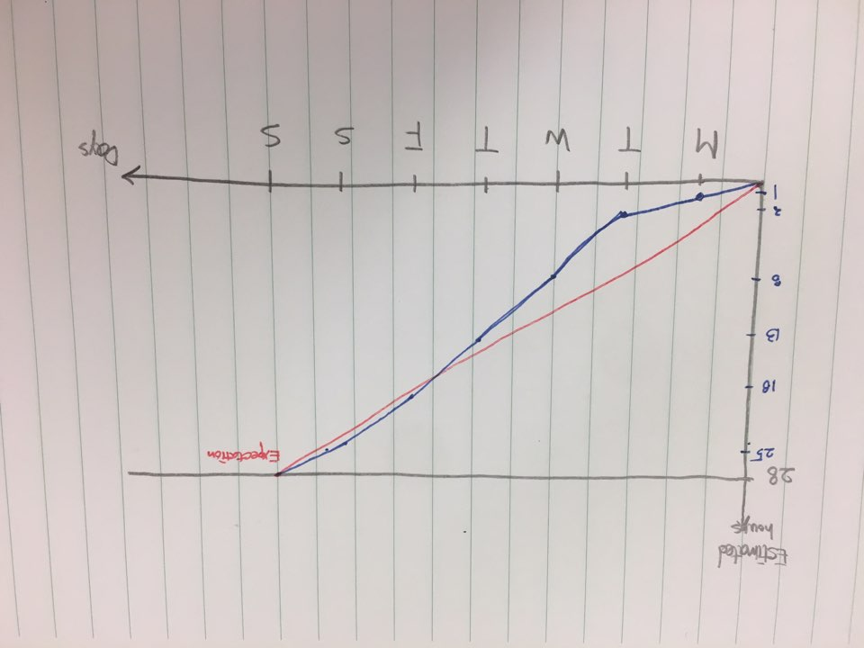

# SPRINT 1 PLAN

## AI-VOCABUALRY BOOK

SPRINT COMPLETION DATE : 07/07/2019

REVISION #1

REVISION DATE : 07/03/2019

GOAL : Make login system

### USER STORY 1

"As a user , I want a login system to get into the site to access the vocabulary

book."

#### TASK 1 : Learning about HTML (5)

#### TASK 2 : Learning about CSS (7)

#### TASK 3 : Learning about JS (3)

#### TASK 4 : Learning about Python (3)

#### TASK 5 : Learning about Django (7)

#### TASK 6 : Make template for login system using HTML (1)

#### TASK 7 : Set up Database for user profile (1)

#### TASK 8 : Using Django auth, make login system (1)

Total for user story 1 : 28

## TEAM ROLES

JAEYOUNG HWANG : Product Owner

SIHWAN PARK : Scrum Master

ALEX HENSHALL : Developer

## Initial task assignment

JAEYOUNG HWANG : user story1, task 6

SIHWAN PARK : user story1, task 1

ALEX HENSHALL : user story1, task 1

## Initial burnup chart

## Initial scrum board

Trello : https://trello.com/b/PSKAaIzM/make-template-for-login-system

## Scrum times

MON 1:30PM - 2:00PM

WED 1:45PM - 2:30PM

THU 4:00PM - 4:30PM
